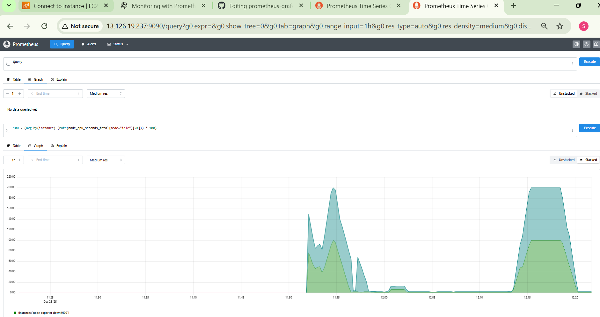
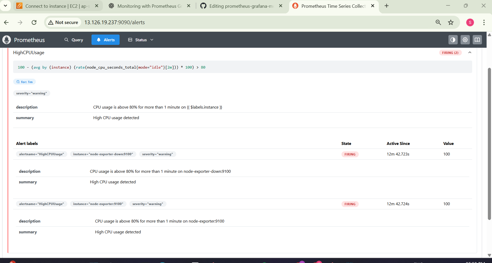
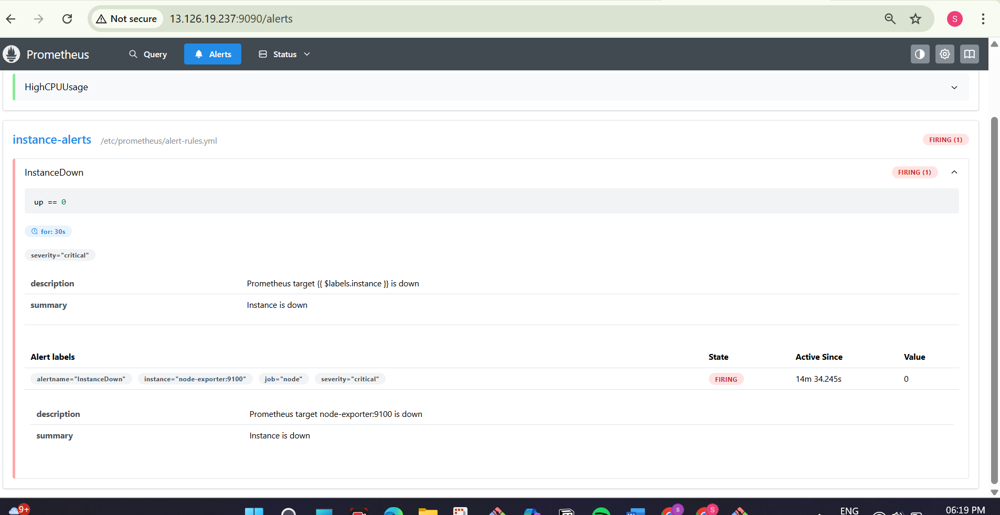
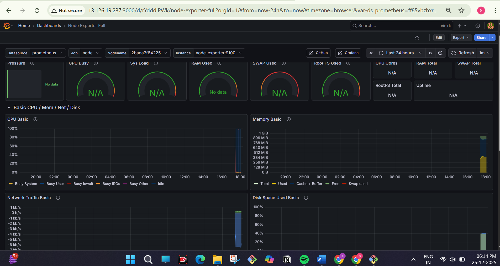

# 📊 Prometheus & Grafana Monitoring with Alerting (CPU & Instance Down)

## 📌 Project Overview

This project demonstrates a **real-world monitoring and alerting setup** using **Prometheus, Node Exporter, Alertmanager, and Grafana** on an **AWS EC2 instance**.

The goal of this project is to:

* Monitor system metrics from an EC2 instance
* Visualize CPU usage using Prometheus and Grafana
* Trigger alerts for **High CPU Usage**
* Trigger alerts for **Instance Down**
* Validate alerts using real stress testing

This setup closely reflects how monitoring is implemented in production environments.

---

## 🛠️ Tech Stack

* AWS EC2 (Amazon Linux)
* Prometheus
* Node Exporter
* Alertmanager
* Grafana
* Docker
* Docker Compose
* Linux

---

## 🏗️ Architecture Overview

* **Node Exporter** exposes system metrics from EC2
* **Prometheus** scrapes metrics and evaluates alert rules
* **Alertmanager** manages alert states (Pending / Firing / Resolved)
* **Grafana** visualizes metrics using dashboards

---

## ⚙️ Monitoring Components

### 🔹 Node Exporter

* Runs on the EC2 instance
* Exposes system metrics on port `9100`

### 🔹 Prometheus

* Scrapes Node Exporter metrics
* Uses PromQL for querying
* Evaluates alert rules for CPU usage and instance availability

### 🔹 Alertmanager

* Receives alerts from Prometheus
* Handles alert lifecycle and grouping

### 🔹 Grafana

* Connected to Prometheus as a data source
* Displays CPU usage and system metrics in graphical form

---

## 🚨 Alerts Implemented

### 🔴 High CPU Usage Alert

* Alert triggers when CPU usage crosses the defined threshold
* CPU load generated using stress testing
* Alert state changes to **FIRING**

### 🔴 Instance Down Alert

* Alert triggers when Prometheus cannot scrape Node Exporter
* Simulates a real instance failure scenario
* Alert changes to **FIRING** state

---

## 📈 Prometheus CPU Usage Query

```promql
100 - (avg by(instance) (
  rate(node_cpu_seconds_total{mode="idle"}[5m])
) * 100)
```

---

## 🧪 Testing & Validation

### ✅ CPU Stress Test

* High CPU load generated on EC2
* CPU usage graph spikes in Prometheus
* High CPU alert successfully triggered

### ✅ Instance Down Test

* Node Exporter / instance stopped
* Prometheus detects target as unavailable
* Instance Down alert fires correctly

---

## 🖼️ Screenshots

### 🔹 Prometheus CPU Usage Graph



### 🔹 CPU Alert – FIRING



### 🔹 Instance Down Alert



### 🔹 Grafana Dashboard



---

## 🎯 Key Learnings

* Prometheus monitoring fundamentals
* Writing effective PromQL queries
* Creating and validating alert rules
* Understanding alert states (Pending, Firing, Resolved)
* Integrating Prometheus with Grafana
* Real-world alert testing using stress scenarios

---

## ✅ Project Status

**Completed and fully tested**

---

## 📌 Conclusion

This project demonstrates hands-on experience with **monitoring, alerting, and observability**, which are critical skills for **DevOps and SRE roles**.
It reflects practical knowledge of how production systems are monitored and alerted in real environments.

---

